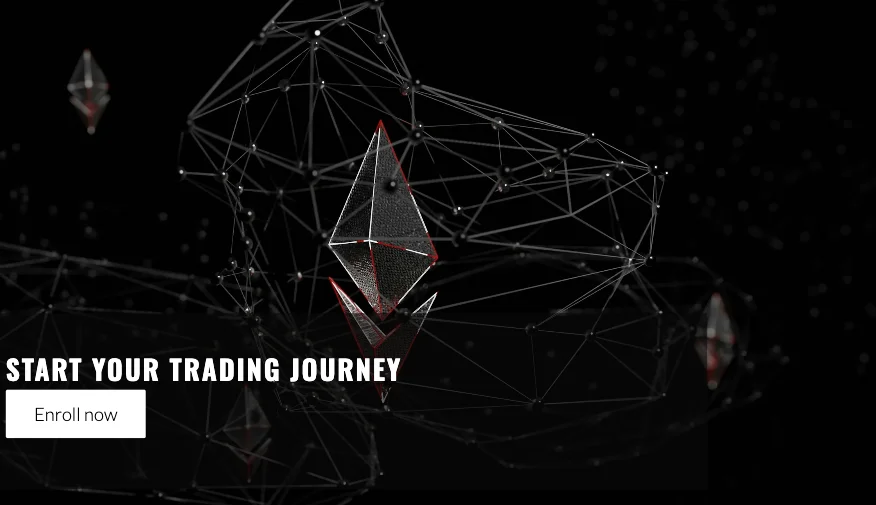
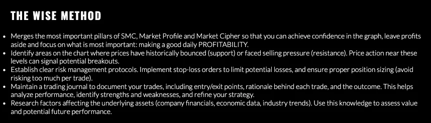

# CryptoSurge, The Wise Method for Crypto Trading

Are you looking to take your cryptocurrency trading to the next level? Look no further than the Wise Method, a revolutionary approach developed by our team of experts.

What is the Wise Method?

The Wise Method is a comprehensive trading strategy designed to help you navigate the ever-changing cryptocurrency market with confidence. It combines fundamental and technical analysis to provide a well-rounded perspective on potential investment

## Features 

### Existing Features

- __Navigation Bar__

  - The user-friendly navigation bar, positioned conveniently at the top, provides access to the following links:
    - **Cryptosurge**, The brand name and logo act as a home button in the top left corner
    - Clear navigation links on the right provide access to **Aboutus** , **Method**, and **Sign Up** sections.
   - intuitive navigation bar keeps you informed, displaying the brand name and offering clear links to all sections, making finding the information you need a breeze.
  - Say goodbye to back button confusion! This intuitive navigation bar ensures smooth sailing between sections, no matter what device you're using.

- __The Header__

  - The header boasts a stunning photograph with a compelling text overlay, all leading to a clear call to action that invites you to dive in.
    - The header image, paired with its text overlay, paints a clear picture of the brand's vision.
    - A compelling call to action button beckons you to explore further and ultimately, sign up.
  - Know exactly where you've landed! The header clearly communicates the site's purpose and target audience.

- __The *About-us* section__

  The "About Us" section provides a quick overview of the company's key areas of focus. In this case, it highlights three benefits users can gain:

- Market Analysis: Learn to analyze the market and anticipate price movements.
- Strategic Trading: Choose the best strategy based on current market conditions.
-  Trading Psychology: Develop emotional control and portfolio management skills for profitable trading.

- __The *Method* section__

  The Wise Method is a trading strategy that combines key elements from three popular technical analysis approaches: Support & Resistance (SMC), Market Profile, and Market Cipher. It aims to:

- Boost Trader Confidence: By analyzing historical price behavior, you can identify potential support and resistance zones, allowing for more confident trading decisions.
- Maximize Daily Profits: The method prioritizes daily profitability over chasing large, infrequent wins.
- Emphasize Risk Management: It stresses the importance of stop-loss orders, proper position sizing, and keeping emotions in check.
- Promote Continuous Improvement: Through trade journaling, you can track your performance, learn from past experiences, and refine your trading strategies.
- Incorporate Fundamental Analysis: The Wise Method encourages researching factors that influence asset prices, giving you a more holistic view of the market.

- __The *Sign up* section__

  - The *Sign up* section allow the user to get signed up to the course and start their trading journey. 
  - The sign up form collects the user's first name, last name, email address and phone number.

- __The Footer__ 

  - The footer section includes links to the relevant social media sites: Youtube, Facebook, Instagram and Twitter.
  - The links will open to a new tab to allow easy navigation for the user. 
  - The footer is valuable to the user as it encourages them to keep connected via social media and increased engagement.

### Features Left to Implement

- Another feature idea

## Testing 

- I tested that this page works in different browsers: Chrome, Firefox and Safari.
- I confirmed that this project is responsive, looks good and functions on all standard screen sizes using the devtools device toolbar.
- I confirmed that the navigation, header, our story, masterclass and sign up text are all readable and easy to understand.
- I have confirmed that the form works: requires entries in every field, will only accept an email in the email field, and the submit button works.

### Validator Testing 

- HTML
  - No errors were returned when passing through the official [W3C validator](https://validator.w3.org/nu/#textarea).
- CSS
  - No errors were found when passing through the official [(Jigsaw) validator](https://jigsaw.w3.org/css-validator/validator).
- Accesibility
  - I confirmed that the colors and fonts chosen are easy to read and accessible by running it through lighthouse in devtools device toolbar.
  

### Unfixed Bugs

- No unfixed bugs

## Deployment

- The site was deployed to GitHub pages. The steps to deploy are as follows: 
  - In the GitHub repository, navigate to the Settings tab. 
  - From the source section drop-down menu, select the Master Branch.
  - Once the master branch has been selected, the page provided the link to the completed website.

The live link can be found here https://andreasaggiomo.github.io/CryptoSurge/

## Credits 

### Content 

- The code to make the navigation bar and sign up section were taken from the [CI Love Running project](https://code-institute-solutions.github.io/love-running-v3/).
- Instructions on how to implement media queries to make the landing page responsive was taken from [MDN Web Docs](https://developer.mozilla.org/en-US/docs/Web/CSS/CSS_media_queries/Using_media_queries).
- The typography of the website was taken from [Google Fonts](https://fonts.google.com/).

### Media

- The favicon icon displayed next to the page title in the browser tab was taken from [Favicon](https://favicon.io/).
- The images in the header, our story, masterclass and sign up sections were taken from [Pexels](https://www.pexels.com/).
- The icons in the footer were taken from [Font Awesome](https://fontawesome.com/).

[def]: assets/images-readme/navbar-readme.webp